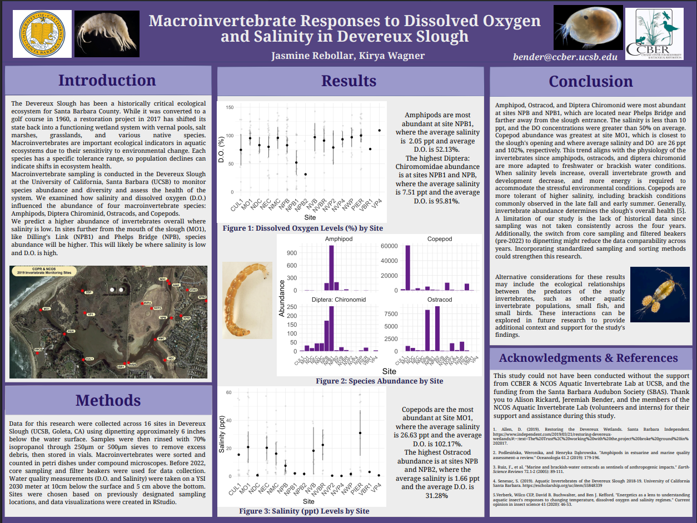

# Photo documentation

## Table

| Photo point number | Date of photo | Season | Direction of photo | Link to photo |
|:--------------|:--------------|:--------------|:--------------|:--------------|
| 31 | April 2024 | Spring | East | [Link to photo](https://ucsb.app.box.com/s/6poaxqa0eu16cuw8m81xcvlyjj1np5vt/file/1648763442274) |
| 31 | October 2025 | Fall | East | [Link to photo](https://ucsb.app.box.com/s/6poaxqa0eu16cuw8m81xcvlyjj1np5vt/file/2055753789459) |
| 19 | April 2024 | Spring | North | [Link to photo](https://ucsb.app.box.com/s/lkg7278kjby3po56j7w5kvhuvqhjmq8b/file/1648756934163) |
| 19 | October 2025 | Fall | North | [Link to photo](https://ucsb.app.box.com/s/lkg7278kjby3po56j7w5kvhuvqhjmq8b/file/2055739177757) |
| 42 | April 2024 | Spring | NE | [Link to photo](https://ucsb.app.box.com/s/l1n165rti3jgivcmwjl499px0hsy93jx/file/1648746246985) |
| 42 | October 2025 | Fall | NE | [Link to photo](https://ucsb.app.box.com/s/l1n165rti3jgivcmwjl499px0hsy93jx/file/2055760228464) |

The 2024–2025 water year was selected because it matches the period covered by the dissolved oxygen (DO) and water temperature data used in this project. This allows the photo documentation to be compared with patterns in the DO and temperature plots. Three photo points were selected: Point 31 for Phelps Bridge, Point 19 for Venoco Bridge, and Point 42 for East Channel. Each photo point shows the water surface at one of the three study sites and provides visual context for the locations where DO was measured.

Across the three sites, the spring photos generally show greener and more abundant vegetation, while the fall photos show drier and more sparse vegetation. Water levels also appear higher in spring than in fall. These seasonal differences provide context for the water quality data, which showed higher DO in spring and lower DO in fall.

# Poster

## Poster information

Title: Macroinvertebrate Responses to Dissolved Oxygen and Salinity in Devereux Slough

Authors: Jasmine Rebollar, Kirya Nicole Wagner

Year published: 2025

Permalink: [https://escholarship.org/uc/item/3kb120zk](https://escholarship.org/uc/item/3kb120zk)

Dataset used: 

The CCBER and NCOS Aquatic Invertebrate Lab monitoring dataset at UCSB. Water quality, including DO and salinity, was measured with a YSI 2030 meter at 10 cm below the surface and 5 cm above the bottom.

Key insights: 

The four invertebrate groups showed different patterns across the slough based on DO and salinity. Low-salinity sites tended to have higher overall invertebrate abundance, and different species appeared to have different tolerance ranges. This suggests that invertebrate abundance can be used as one indicator of slough health.

Relevance to study:

This poster studies the same wetland system as this project, and the sampling sites appear to overlap with the three main sites used here: NEC with East Channel, NPB with Phelps Bridge, and NVBR with Venoco Bridge. The poster also measures DO at two depths, which connects to the use of elevation codes to examine possible stratification. This project uses three elevation codes instead of two and focuses more directly on DO patterns across sites, temperature, and elevation.

The poster adds ecological context because it links DO and salinity conditions to aquatic invertebrate patterns. While this project focuses on DO as a water quality variable, the poster helps show why differences in DO may matter biologically. The association between different invertebrate groups and different DO and salinity conditions suggests that DO differences across East Channel, Phelps Bridge, and Venoco Bridge may reflect meaningful habitat differences.

# Annotated bibliography

### Paper 1

Title: Spatiotemporal Variability of Dissolved Oxygen in Response to Morphological State in a Central California Coast Bar-Built Estuary

Authors: Jason Dawson, Mara M. Orescanin, Ross Clark, Kevin O'Connor

Main findings:

DO loggers were deployed across the three main branches of Carmel River Lagoon from February to August 2020. This period included fully open, intermittently closed, and fully closed mouth states. DO varied across branches and over time as mouth state changed. Individual branches also showed signs of stratification and lower bottom DO during closed states.

Relevance to study:

This study provides a strong comparison for the NCOS project because it also examines DO across different parts of a California bar-built estuary. Devereux Slough is also a bar-built estuary, so the system type is a good match. The finding that DO can vary across branches within the same estuary supports comparing East Channel, Phelps Bridge, and Venoco Bridge as separate study sites [@dawson2023].

### Paper 2

Title: Vertical Mixing Processes in Intermittently Closed and Open Lakes and Lagoons, and the Dissolved Oxygen Response

Authors: E. Gale, C. Pattiaratchi, R. Ranasinghe

Main findings:

This study found that shallow intermittently closed and open lakes and lagoons can still become stratified, even though they are small and shallow. Stratification can be caused by salinity, temperature, and wind conditions. When stratification limits mixing, bottom-water DO can drop while surface-water DO stays higher.

Relevance to study:

The main connection to this project is the vertical DO pattern. Since stratification can lower bottom-water DO while surface water remains more oxygenated, this paper helps explain why elevation codes may show different DO values within the same site. This supports using elevation code as a way to examine possible stratification at East Channel, Phelps Bridge, and Venoco Bridge [@gale2006].

### Paper 3

Title: Dissolved Oxygen Dynamics in a Eutrophic Estuary, Upper Newport Bay, California

Authors: Nikolay P. Nezlin, Krista Kamer, Jeff Hyde, Eric D. Stein

Main findings:

This study measured surface and bottom DO at three stations in Upper Newport Bay, including the head, middle, and mouth of the estuary. Hypoxic events were linked to several factors, including low solar radiation, freshwater discharge after precipitation, and haline stratification. At the head of the estuary, macroalgal biomass and stratification contributed to higher surface DO and lower bottom DO.

Relevance to study:

This paper helps frame the NCOS elevation-code comparison because it uses surface and bottom DO measurements across stations in a Southern California estuary. The study also connects low bottom DO to stratification, algae, and freshwater input, which are possible factors in wetland DO patterns. This makes it useful for interpreting DO differences across sites and sampling positions [@nezlin2009].

### Paper 4

Title: Oxygen Drives Benthic-Pelagic Decomposition Pathways in Shallow Wetlands

Authors: Gea H. Van der Lee, Michiel H. S. Kraak, Ralf C. M. Verdonschot, J. Arie Vonk, Piet F. M. Verdonschot

Main findings:

This paper measured oxygen, microbes, and invertebrates in the bottom water and surface water of shallow wetlands. When bottom water stayed low in oxygen, microbial decomposition increased near the bottom. Invertebrates were also more likely to move toward the surface water to feed when oxygen was low near the bottom.

Relevance to study:

The paper connects DO patterns to ecological processes within shallow wetlands. Lower oxygen near the bottom can affect decomposition, nutrient cycling, and where organisms are active in the water column. This supports treating DO differences across elevation codes as ecologically meaningful, not just as measurement differences [@vanderlee2017].

### Paper 5

Title: Dissolved Oxygen May Limit the Suitability of Salt Marsh as Nekton Habitat

Authors: A. Clark, William T. Ellis, Alexandra R. Rodriguez, Ronald Baker

Main findings:

This study measured DO across 10 salt marsh sites in the Mississippi Sound. DO loggers were placed from open water into flooded, vegetated marsh areas. DO often dropped inside the vegetated marsh, especially several meters past the marsh edge. These low-oxygen conditions could limit the use of flooded marsh habitat by fish and other nekton.

Relevance to study:

This study adds habitat context to the NCOS project. Low DO in vegetated marsh areas can limit habitat quality for fish and other nekton, which helps explain why site-level DO differences matter. This is especially useful when interpreting sites with more vegetation or slower water movement [@clark2025].

### Paper 6

Title: Water Quality Fluctuations in Small Intermittently Closed and Open Lakes and Lagoons (ICOLLs) After Natural and Artificial Openings

Authors: Maddison Mayjor, Amanda J. Reichelt-Brushett, Hamish A. Malcolm, Andrew Page

Main findings:

This study measured water quality parameters, including temperature, DO, pH, and salinity, in four intermittently closed and open lakes and lagoons before and after mouth-opening events. Artificial openings were linked to sharper DO declines and fish kills, while natural openings caused smaller water-quality changes. The authors show that these systems can be highly variable.

Relevance to study:

This paper supports the site-comparison part of the project. ICOLLs can respond strongly to changes in ocean connection, and Devereux Slough is also an intermittently closed coastal system. This is especially relevant for Venoco Bridge because it is closest to the slough mouth and may respond differently than East Channel or Phelps Bridge [@mayjor2023].

### Paper 7

Title: Structural and Functional Loss in Restored Wetland Ecosystems

Authors: David Moreno-Mateos, Mary E. Power, Francisco A. Comín, Roxana Yockteng

Main findings:

This paper used a meta-analysis of restored wetlands to compare restored sites with reference wetlands. The authors found that restored wetlands often had lower biological structure and biogeochemical function than reference sites, even many decades after restoration. They also found that recovery depended on site conditions, including wetland size, climate, and hydrologic exchange.

Relevance to study:

The restoration focus of this paper helps frame why water quality monitoring at NCOS matters. Restored wetlands can look structurally recovered while some ecological and biogeochemical functions remain lower than reference wetlands. DO is one way to examine whether water quality conditions differ across restored wetland sites [@morenomateos2012].

### Paper 8

Title: Shallow Salt Marsh Tidal Ponds: An Environment With Extreme Oxygen Dynamics

Authors: Ketil Koop-Jakobsen, Martin S. Gutbrod

Main findings:

This study measured oxygen, pH, and CO2 in shallow salt marsh tidal ponds. Oxygen conditions changed strongly through the day, with high oxygen during daylight and hypoxic conditions at night. The study also found steep oxygen gradients near the sediment-water interface, showing that sediment processes and benthic photosynthesis can strongly affect oxygen conditions.

Relevance to study:

This study is useful for interpreting shallow wetland oxygen dynamics. It shows that light, sediment processes, benthic algae, and respiration can create strong oxygen changes in shallow marsh habitats. Because the water column in this study was mostly well mixed, it is better used as support for shallow-marsh DO dynamics than as direct evidence of water-column stratification [@koopjakobsen2019].

### Paper 9

Title: Seasonal Drivers of Dissolved Oxygen Across a Tidal Creek-Marsh Interface Revealed by Machine Learning

Authors: Peter J. Regier, Nicholas D. Ward, Allison N. Myers-Pigg, Jay W. Grate, Michael J. Freeman, Ruby N. Ghosh

Main findings:

This study used high-frequency DO measurements from three locations across a tidal creek-marsh interface. The authors found that DO drivers changed by season. In winter, terrestrial and flood-related conditions were more important, while in summer, aquatic processes such as tidal, diel, and lunar cycles were more important.

Relevance to study:

This paper supports the seasonal and spatial parts of the NCOS project. DO drivers changed by season and differed across three locations along a tidal creek-marsh interface. That pattern supports comparing the three NCOS sites separately and considering temperature and season when interpreting DO [@regier2023].

### Paper 10

Title: Dissolved Oxygen Dynamics in Salt Marsh Pools and Its Potential Impacts on Fish Assemblages

Authors: Kelly J. Smith, Kenneth W. Able

Main findings:

This study measured DO in five high-salinity salt marsh pools over multiple 24-hour periods. DO changed strongly over the day, usually peaking in the afternoon and reaching its lowest point early in the morning. In midsummer, DO sometimes dropped from very high levels to nearly anoxic conditions. Fish species also differed in how well they tolerated low DO.

Relevance to study:

This paper adds ecological context for why short-term DO changes matter in shallow marsh habitats. The study shows that DO can shift from very high to very low over a single day, and that those changes can affect fish use of marsh pools. Although the NCOS project does not study fish directly, the paper helps explain why low DO periods may matter for habitat quality [@smith2003].

### Paper 11

Title: Diel and Tidal pCO2 x O2 Fluctuations Provide Physiological Refuge to Early Life Stages of a Coastal Forage Fish

Authors: Emma L. Cross, Christopher S. Murray, Hannes Baumann

Main findings:

This study tested how early life stages of the coastal forage fish Menidia menidia responded to different pCO2 and DO conditions. Static low DO reduced survival, growth, and development. However, cycling DO and pCO2 conditions reduced some of the negative effects compared with constant stressful conditions.

Relevance to study:

This paper is not a direct methods match because it is a lab-based fish physiology study rather than a wetland monitoring study. Its value is ecological context. It shows that coastal organisms may respond differently to constant low DO versus naturally cycling DO, which supports considering DO variability rather than only average DO [@cross2019].

### Paper 12

Title: Assessing Constructed Wetland Functional Success Using Diel Changes in Dissolved Oxygen, pH, and Temperature in Submerged, Emergent, and Open-Water Habitats in the Beaver Creek Wetlands Complex, Kentucky (USA)

Authors: Brian C. Reeder

Main findings:

This study used DO, pH, and temperature patterns to evaluate functional success in constructed wetlands. DO patterns differed among submerged vegetation, emergent vegetation, and open-water habitats. Vegetated areas sometimes had very low DO before dawn, while open-water areas had less extreme DO changes.

Relevance to study:

This paper fits the restored-wetland side of the project. It uses DO, pH, and temperature to evaluate how constructed wetland habitats function, and it shows that open-water and vegetated areas can have different DO patterns. This supports interpreting NCOS site differences as possible differences in habitat structure, vegetation, or water movement [@reeder2011].

# References